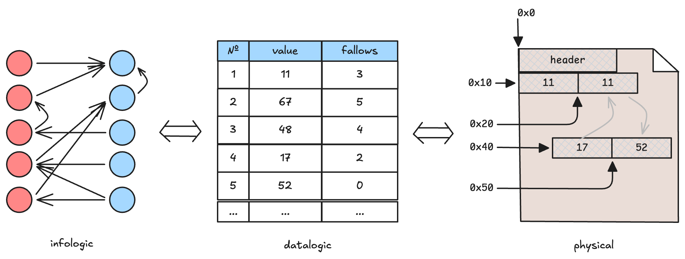

# Introductory Experiment: Экспериментальное введение в курс «Операционные системы»

Вариант формируется из следующих параметров, определяющих формат сравнения в эксперименте:

|Параметр        | Описание                                                     |
| -------------- | ------------------------------------------------------------ |
| Read/Write     | Тип нагрузки, участвующий в сравнении: чтение или запись     |
| Cache/No cache | Способ работы с памятью: использовать системный кеш или нет  |
| Size           | Размер файла для тестирования                                |
| Seq/Rand       | Использовать модель случайного или последовательного доступа |

Пояснение к смыслу вариантов: [exp-variants.png](./img/exp-variants.png).

---

> [!TIP]
> Общие методические материалы:
> - [`doc/experiments/environment.md`](../../doc/experiments/environment.md) — настройка и изоляция окружения
> - [`doc/experiments/monitoring.md`](../../doc/experiments/monitoring.md) — утилиты мониторинга и как читать их вывод
> - [`doc/experiments/statistics.md`](../../doc/experiments/statistics.md) — доверительные интервалы, выбор числа измерений N


Современные операционные системы предоставляют два принципиально разных способа доступа к файлу:

1. через обычные функции `read()`/`write()` и перемещение к позиции в файле с помощью `lseek()`;
2. через отображение файла в память с помощью функции `mmap()`.

Понимание возможностей и ограничений этих подходов важно при разработке приложений, работающих с данными.

В рамках задания принимаем модель данных, в которой записи представлены в виде вершин
графа, а доступ к ним осуществляется путём обхода связей между вершинами.
Вершины имеют фиксированное положение в файле и могут находиться ближе к своим
соседям или дальше от них.



Как именно хранятся данные и сколько места они занимают, нас не очень интересует.
Важно то, что данные могут располагаться в близких или удалённых участках файла,
а соответственно, и жёсткого диска.

## 0. Цель работы

Экспериментально сравнить время работы выданных прототипов приложений, моделирующих отдельные
сценарии нагрузки, характерные при работе с данными: **чтение/обновление**
записей на диске в **последовательном/случайном** порядке.

А также научиться корректно ставить эксперимент над ОС: фиксировать окружение,
выбирать инструменты, планировать число измерений и статистически обрабатывать
результаты, а не делать выводы по 1–3 запускам «на глаз». Эти базовые
принципы помогут при проведении исследований в профессиональной деятельности или, например, во время выполнения ВКР.

## 1. Предмет исследования

Итоговая метрика каждого эксперимента — одно число: **оценка времени**
обхода вершин графа.

Приложения, участвующие в эксперименте, находятся в репозитории по следующим путям:

- `lab/util/graphgen.py` — параметризованный генератор графа: создаёт бинарный
  файл с сериализованной в него структурой данных.
- `lab/intro-exp/src/graph_traverse.c` — обходит граф с помощью
  `read()`/`lseek()`.
- `lab/intro-exp/src/graph_traverse_mmap.c` — та же логика обхода, но с помощью
  `mmap()`.

Оба приложения имеют набор опций командной строки:

```sh
<app> [--write] [--no-cache] <iterations> <file1> [file2 ...]
```

- `--write` — обход в режиме записи (меняет данные в посещаемых вершинах);
- `--no-cache` — отключает системное кеширование (с нюансом для `mmap()`);
- `<iterations>` — число повторений обхода (чтобы увеличить время работы);
- `[file2 ...]` — дополнительные файлы для обхода (чтобы увеличить время работы,
  но по-другому).

> [!NOTE]
> Детали реализации `--no-cache` не так важны, но если интересно, их можно
  почерпнуть в комментариях к [`src/graph_io.h`](src/graph_io.h) и
  [`src/graph_traverse_mmap.c`](src/graph_traverse_mmap.c).

## 2. Подготовка тестовых данных

Сгенерируйте два графа одинакового размера и с одинаковым `seed`, но с разной
топологией:

* случайный физический порядок — связный список обходит все записи, но соседние
  в списке записи в основном находятся на разных страницах файла:
```sh
python3 ../util/graphgen.py -s 10M --seed 427 --topology chain -b 0.5 --min-step-pages 2 -o graph-rand.bin
```

* последовательный физический порядок — запись `i` указывает на `i + 1`, поэтому
  порядок обхода совпадает с порядком записей в файле:
```sh
python3 ../util/graphgen.py -s 10M --seed 427 --topology sequential -o graph-seq.bin
```

Пояснения к параметрам смотрите в выводе `--help`. Вкратце:

- `-s` — размер файла графа;
- `--seed` — зерно генерации;
- `--topology` — структура итогового графа: линейный последовательный или
  линейный случайный.

> [!CAUTION]
> Не используйте `--topology chain` для `graph-seq.bin`: `chain` описывает форму
графа, но намеренно размещает путь в случайном порядке физических смещений — в задании была ошибка.

## 3. Сборка приложений

Обе программы рассчитаны на Linux, macOS и FreeBSD. Потребуется установить компилятор `clang` или `gcc`.

```sh
mkdir -p out
clang -o out/graph_traverse src/graph_traverse.c
clang -o out/graph_traverse_mmap src/graph_traverse_mmap.c
```


## 4. Этап 1: исследование `graph_traverse` (read/lseek)

Примеры инструментов измерения ниже **ориентированы на Linux**; на других ОС
нужны соответствующие аналоги.

### Шаг 4.1. Снять паспорт системы

Нужно собрать максимум важной для эксперимента информации о системе, чтобы:

1. эксперимент можно было воспроизвести для проверки;
2. можно было правильно интерпретировать полученные данные.

Подробная справка по утилитам находится в документе
[`doc/experiments/monitoring.md`](../../doc/experiments/monitoring.md), раздел
«Паспорт системы»: `uname -a`, `lscpu`, `lscpu -e`, `free -h`, `lshw`/`smartctl`
для диска, `nproc`.

Если информацию получить не удалось, укажите причину в отчёте, но не подменяйте
неизвестные параметры догадками.
 
Собранная информация будет служить основанием
для дальнейших выводов по работе и ни в коем случае не должна замалчиваться.

> [!NOTE]
> Если работа выполняется в виртуальной машине, неполный или обобщённый вывод
> части команд в гостевой ОС — ожидаемое поведение. Подумайте, почему
> одни параметры доступны, а другие — нет.
>
> Недостающие сведения постарайтесь определить как-то иначе,
> например, из хостовой системы. Но не забывайте указывать источник полученной
> информации. И не выдавайте характеристики виртуального устройства за
> характеристики физического хоста. 


### Шаг 4.2. Подготовить окружение

Перед проведением эксперимента необходимо подготовить *свою лабораторию*:
завершить фоновые задачи, зафиксировать регулятор частоты CPU (CPU governor),
закрепить процесс на ядре, сбросить или прогреть системный кэш.

Подробная инструкция с чек-листом и пояснениями приводится в документе
[`doc/experiments/environment.md`](../../doc/experiments/environment.md).

Чистое рабочее окружение позволяет получить более достоверные и воспроизводимые
результаты. Если от чего-то «очиститься» не удаётся, стоит зафиксировать этот
факт в отчёте и учесть его при интерпретации измерений.

### Шаг 4.3. Ознакомительные (baseline) измерения

Запустите приложение по одному разу на каждом графе и посмотрите, как оно
работает. Затем попробуйте выполнить запуски с отключённым кэшем и в режиме
изменения данных:

```sh
time ./out/graph_traverse 1 graph-rand.bin
time ./out/graph_traverse 1 graph-seq.bin

time ./out/graph_traverse --no-cache 1 graph-rand.bin
time ./out/graph_traverse --no-cache 1 graph-seq.bin

time ./out/graph_traverse --write 1 graph-rand.bin
time ./out/graph_traverse --write 1 graph-seq.bin

time ./out/graph_traverse --write --no-cache 1 graph-rand.bin
time ./out/graph_traverse --write --no-cache 1 graph-seq.bin
```

При необходимости измените *в разумных пределах* размер файла графа, если один
из сценариев запуска вашего варианта выполняется слишком долго (более 20–30
секунд и не 0).

> [!NOTE]
> Если вы работаете в виртуальной машине, WSL или Docker (на Windows и macOS
> эти технологии также используют виртуализацию), файл графа нужно размещать
> в директории на основном разделе диска, например **в домашнем каталоге** `~/`.
>
> При обращении к общей с хостовой машиной директории виртуальная гостевая
> машина будет преодолевать много слоёв виртуализации.


Обратите внимание на соотношение времени `usr`/`sys` — это и есть метрика
User/Kernel Time из паспорта эксперимента. В режиме `--write` следует ожидать
большего значения `sys time`, чем при чтении, из-за обратной записи изменённых
страниц. С помощью `strace` определите, как отличается поведение приложения в
разных режимах; для удобства сравнения воспользуйтесь опциями утилиты.

Для более детальной картины используйте `/usr/bin/time -v` и `perf stat`
(события `context-switches`, `cpu-migrations`, `page-faults`,
`cache-misses`) — см.
[`doc/experiments/monitoring.md`](../../doc/experiments/monitoring.md).

Повторите один из запусков с фоновой нагрузкой, чтобы увидеть,
как выглядит «шумное» измерение. Для дополнительной нагрузки системы
воспользуйтесь `stress-ng` или другим похожим бенчмарком.

Зафиксируйте свои наблюдения в отчёте.

### Шаг 4.4. Сформулировать гипотезу

Запишите явно, что вы ожидаете и почему, например:

- на HDD разница должна быть выражена сильнее, чем на SSD/NVMe, из-за
  времени позиционирования головки;
- файл меньшего размера обходится быстрее при любой конфигурации запуска.

Здесь стоит подумать, что на ваш взгляд является важным с точки зрения работы
операционной системы и вашего варианта эксперимента.

### Шаг 4.5. Спланировать эксперимент

Перед тем как начать тестирование приложений, нужно понять, как
оно будет проводиться, — составить план.

От порядка выполнения и количества измерений может зависеть результат, например,
CPU нагреется и перейдёт в режим троттлинга, запустится фоновая задача
и т. д.

Поэтому стоит использовать интерливинг запусков разных конфигураций, а не
запускать их сериями блоков. Так мы сможем защититься от систематического
дрейфа.

Зафиксируйте в отчёте:

1. Какая метрика на запуск используется.
2. Методология прогревания/охлаждения кэша (раздел 4.2) — одна и та же для всей
   серии одной конфигурации.
3. Число повторов `N` и порядок запусков.
4. Что делать с прогревочными запусками — сколько первых отбрасывается и почему
   (решение принимается **до** просмотра результатов).
5. Разделение измерения и мониторинга — финальную серию, которая пойдёт в отчёт,
   замеряйте минимально инвазивным способом.

Как обосновать N и что такое доверительный интервал в этом контексте описано в
документе
[`doc/experiments/statistics.md`](../../doc/experiments/statistics.md).

### Шаг 4.6. Зафиксировать окружение перед серией

Повторите шаг 4.1 непосредственно перед стартом финальной серии («снимок
до»): `uptime`, `top -bn1`, при наличии доступа — температура/троттлинг.

Здесь нужно убедиться, что ничего не изменилось и окружение осталось стабильным.

### Шаг 4.7. Провести серию измерений

Проводить измерения вручную долго и утомительно. Здесь стоит применить
навыки написания сценариев оболочки и автоматизировать процесс. Можно отдельно
проверить, влияет ли такая автоматизация на результаты измерений.

Ниже приведён сгенерированный ИИ пример скрипта сбора данных для Linux. Напишите свой скрипт самостоятельно:

```bash
#!/usr/bin/env bash
set -euo pipefail

CORE=2
N=30
ITER=5
OUT=results_read.csv
echo "timestamp,graph,run_id,wall_time_s,user_time_s,sys_time_s,vol_ctx,invol_ctx,minflt,majflt" > "$OUT"

graphs=(graph-seq.bin graph-rand.bin)
for i in $(seq 1 "$N"); do
  for g in "${graphs[@]}"; do
    ts=$(date +%s)
    /usr/bin/time \
      -f "$ts,$g,$i,%e,%U,%S,%w,%c,%R,%F" \
      -a -o "$OUT" \
      taskset -c "$CORE" ./out/graph_traverse --no-cache "$ITER" "$g" \
      > /dev/null
  done
done
```

Требования к скрипту сбора: сохраняет сырые данные каждого запуска[^enough-data] (не
только среднее); сохраняет достаточно метаданных для воспроизведения
(имя графа, `--no-cache`/`--write`, число итераций, `taskset`); входит
целиком в сдаваемые материалы, и его можно воспроизводимо запустить на защите. Логи в
текст отчёта вставлять не нужно; при необходимости лучше поместить их в приложение.

[^enough-data]: В разумных пределах, конечно же, не нужно хранить десятки-сотни гигабайт логов.

### Шаг 4.8. Проанализировать измерения

Для сравниваемых конфигураций посчитайте среднее время, стандартное отклонение и
доверительный интервал (методика —
[`doc/experiments/statistics.md`](../../doc/experiments/statistics.md)). Явно
опишите, что сделано с выбросами/прогревом.

Изобразите на графике полученные точки оценок мат. ожидания с усами
доверительного интервала — поскольку измерение точечное (не зависимость от
параметра), развёрнутый график не нужен. Из него должно быть видно взаимное
расположение точек и доверительных интервалов для каждой сравниваемой
конфигурации.

Для большей иллюстративности попросите вашего Джарвиса построить графики
плотности распределения, обе сравниваемые серии на одном графике («layered
plot»). Это может быть наивная гистограмма или более качественный её аналог —
KDE [*Кстати, в чем разница между ними?*]. Так вы явно увидите различия
полученных измерений и сможете понять, почему нельзя наивно считать, что
распределение "нормальное".

### Шаг 4.9. Сформулировать вывод

Ответьте явно:

1. **Сравнение**: что больше/меньше и насколько? Согласуется ли с гипотезой
   шага 4.4? Если нет — какой механизм ОС/железа это объясняет?
2. **Погрешность**: устраивает ли вас ширина ДИ? Пересекаются ли доверительные
   интервалы сравниваемых измерений?
3. **Достаточность**: помогут ли делу ещё N измерений? Оцените (хотя бы
   грубо) по формуле из общей методички.

## 5. Этап 2: исследование `graph_traverse_mmap`

Повторите шаги 4.1–4.9 для `graph_traverse_mmap`, самостоятельно написав
скрипты сбора по аналогии с этапом 1:

```sh
./out/graph_traverse_mmap --write --no-cache 1 graph-seq.bin
./out/graph_traverse_mmap --write --no-cache 1 graph-rand.bin
```

Отличия, на которые стоит обратить внимание:

- сравните количество переключений контекста (context switches) и страничных
  ошибок (page faults) для `read()`/`lseek()` и `mmap()`, объясните наблюдения и
  учтите их при анализе измерений;

- ожидайте, что выводы **изменятся** по сравнению с этапом 1 — в этом и
  ценность повторного исследования. Не подгоняйте методологию под то, чтобы
  получить «те же» выводы.

## 6. Этап 3: итоговое сравнение и общий вывод

Разместите графики всех серий измерений рядом (`graph_traverse`×2 и
`graph_traverse_mmap`×2) и сравните их качественно и количественно.

Дайте общий вывод по работе:

- Какие условия измерения оказались критичными, а чем можно было
  пренебречь? (например: `taskset` оказался важен, а конкретная модель
  диска — не так важна, если граф поместился в кэш и т.п. — используйте
  свои реальные наблюдения);
- Насколько интрузивны были сами инструменты измерения? Отличалось ли время
  обхода под `perf stat`/`strace` от времени под «голым» `time`/
  `/usr/bin/time`? См. раздел 8 в
  [`doc/experiments/statistics.md`](../../doc/experiments/statistics.md).

## 7. Что сдаётся

1. Скрипт генерации графов с использованными опциями и
   скрипты сбора измерений (Этап 1 и Этап 2) — должны воспроизводимо
   запускаться.
2. Сырые данные (CSV или аналогичный формат) по всем четырём сериям.
3. Скрипт/ноутбук обработки данных.
4. Отчёт, включающий: паспорт системы, описание настройки окружения,
   гипотезы, обоснование N и методологии работы с кэшем, таблицу и график
   сравнения четырёх серий.

> [!IMPORTANT]
> Не надо включать в отчёт всё! Скрипты и логи поместите отдельно в приложении, в основном тексте только **основное**.
> Подробнее смотрите: [doc/report.md](../../doc/report.md)

## 8. Требования к защите

Будьте готовы по требованию:

- показать и заново прогнать скрипты сбора измерений (включая генерацию графов
  через `graphgen.py`) на любой доступной машине;
- объяснить каждое решение по настройке окружения;
- объяснить, как посчитан доверительный интервал и что произойдёт с выводом,
  если N увеличить/уменьшить;
- обосновать выбор размера графа (`-s`) относительно объёма RAM и выбранной
  методологии кэша.

## 9. Дополнительные материалы

- Видеогайд по постановке экспериментов: <https://youtu.be/0VKhPE1lWos>
- [`doc/experiments/environment.md`](../../doc/experiments/environment.md)
- [`doc/experiments/monitoring.md`](../../doc/experiments/monitoring.md)
- [`doc/experiments/statistics.md`](../../doc/experiments/statistics.md)
- `man`
